Trong lỗ hỏng SMBGhost ([CVE-2020-0796](https://github.com/datntsec/CVE-2020-0796)) tôi đã nói về một kĩ thuật write-what-where primitive thông qua việc sử dụng bug overflow integer để thay đổi con trỏ Alloc.Userbuffer trỏ đến một địa chỉ mà ta mong muốn và ghi dữ liệu tùy ý vào đó. Tương tự như SMB Ghost, lỗ hỏng này cũng tổn tại ở hàm Srv2DecompressData trong srv2.sys. Cùng xem lại hàm Srv2DecompressData liên quan đến lỗ hỏng SMBGhost (CVE-2020-0796) đã được đơn giản hóa bởi [Zecops](https://blog.zecops.com)
``` c
typedef struct _COMPRESSION_TRANSFORM_HEADER
{
    ULONG ProtocolId;
    ULONG OriginalCompressedSegmentSize;
    USHORT CompressionAlgorithm;
    USHORT Flags;
    ULONG Offset;
} COMPRESSION_TRANSFORM_HEADER, *PCOMPRESSION_TRANSFORM_HEADER;
 
 
typedef struct _ALLOCATION_HEADER
{
    // ...
    PVOID UserBuffer;
    // ...
} ALLOCATION_HEADER, *PALLOCATION_HEADER;
 
 
NTSTATUS Srv2DecompressData(PCOMPRESSION_TRANSFORM_HEADER Header, SIZE_T TotalSize)
{
    PALLOCATION_HEADER Alloc = SrvNetAllocateBuffer(
        (ULONG)(Header->OriginalCompressedSegmentSize + Header->Offset),
        NULL);
    If (!Alloc) {
        return STATUS_INSUFFICIENT_RESOURCES;
    }
 
 
    ULONG FinalCompressedSize = 0;
 
 
    NTSTATUS Status = SmbCompressionDecompress(
        Header->CompressionAlgorithm,
        (PUCHAR)Header + sizeof(COMPRESSION_TRANSFORM_HEADER) + Header->Offset,
        (ULONG)(TotalSize - sizeof(COMPRESSION_TRANSFORM_HEADER) - Header->Offset),
        (PUCHAR)Alloc->UserBuffer + Header->Offset,
        Header->OriginalCompressedSegmentSize,
        &FinalCompressedSize);
    if (Status < 0 || FinalCompressedSize != Header->OriginalCompressedSegmentSize) {
        SrvNetFreeBuffer(Alloc);
        return STATUS_BAD_DATA;
    }
 
 
    if (Header->Offset > 0) {
        memcpy(
            Alloc->UserBuffer,
            (PUCHAR)Header + sizeof(COMPRESSION_TRANSFORM_HEADER),
            Header->Offset);
    }
 
 
    Srv2ReplaceReceiveBuffer(some_session_handle, Alloc);
    return STATUS_SUCCESS;
}

```

Hàm Srv2DecompressData nhận vào một message được nén do client gửi đến và tiến hành cấp phát một vùng nhớ cần thiết, giải nén message vào đó. Sau đó, nếu trường Offset khác không, nó sẽ copy data (RawData) ở trước data được nén vào phần đầu vùng nhớ được cấp phát.


Lỗi SMBGhost nằm ở việc hàm không kiểm tra integer overflow, dẫn đến cấp phát sai kích thước gây ra buffer overflow. Sau 3 tháng kể từ ngày Microsoft vá SMBGhost, lỗ hỏng CVE-2020-1206 (SMBleed - theo cách gọi của Zecops Blog) được tìm thấy. Lỗ hỏng này cho phép chúng ta leak được địa chỉ của máy khác, và nếu kết hợp với SMBGhost, ta có thể có được RCE. Để có cái nhìn đơn giản hơn về hàm Srv2DecompressData, ta sẽ dùng lại hàm này khi chưa được vá lỗi SMBGhost và giả sử rằng nó đã được vá.

# Faking OriginalCompressedSegmentSize again
Như SMBGhost, lần này ta vẫn sẽ giả mạo OriginalCompressedSegmentSize với một số lớn hơn một chút so với dữ liệu giải nén mà ta gửi. Ví dụ ta nén một data có kích thước x byte, thay vì đặt vào trường OriginalCompressedSegmentSize x, ta sẽ đặt thành x + 0x1000, xem hình sau sẽ rõ hơn:

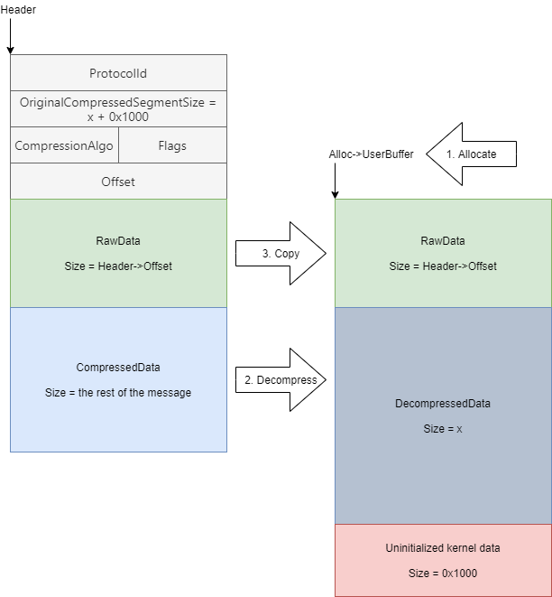

Uninitialized kernel data sẽ được coi như một phần của message.

Như ở bài phân tích [CVE-2020-0796](https://github.com/datntsec/CVE-2020-0796) tôi có nói, Srv2DecompressData vẫn sẽ bỏ qua giai đoạn kiểm tra sau hàm SmbCompressionDecompress nếu việc decompress diễn ra thành công:
``` c
if (Status < 0 || FinalCompressedSize != Header->OriginalCompressedSegmentSize) {
    SrvNetFreeBuffer(Alloc);
    return STATUS_BAD_DATA;
}
```

Mặc dù trường OriginalCompressedSegmentSize được đặt thành x + 0x1000 thay vì x, nhưng sau khi giải nén thành công, biến FinalCompressedSize không chứa giá trị x, mà sẽ chưa giá trị x + 0x1000:
```c
NTSTATUS SmbCompressionDecompress(
    USHORT CompressionAlgorithm,
    PUCHAR UncompressedBuffer,
    ULONG  UncompressedBufferSize,
    PUCHAR CompressedBuffer,
    ULONG  CompressedBufferSize,
    PULONG FinalCompressedSize)
{
    // ...
 
    NTSTATUS Status = RtlDecompressBufferEx2(
        ...,
        FinalUncompressedSize,
        ...);
    if (status >= 0) {
        *FinalCompressedSize = CompressedBufferSize;
    }
 
    // ...
 
    return Status;
}
```

Bởi vì sau khi giải nén thành công, FinalCompressedSize được cập nhật để giữ giá trị CompressedBufferSize (tương ứng với OriginalCompressedSegmentSize được truyền vào hàm SmbCompressionDecompress). Việc cập nhật và kiểm tra sau đó là gần như không cần thiết, có thể dẫn đến một số lỗi không mong muốn.


# Basic exploitation
Cấu trúc message mà Zecops sử dụng để chứng minh lỗ hỏng là [SMB2 WRITE message](https://docs.microsoft.com/en-us/openspecs/windows_protocols/ms-smb2/e7046961-3318-4350-be2a-a8d69bb59ce8). Cấu trúc này chứa các trường như số byte có thể write, flag,..., theo sau là một buffer có độ dài tùy ý. Điều này khá hoàn hảo để khai thác lỗi, vì ta có thể tạo một message và chỉ định header, với một buffer chứa data chưa được khởi tạo.
Dựa trên POC của Zecops trên kho lưu trữ WindowsProtocolTestSuites của Microsoft, để để có cái nhìn rõ hơn về về điều này, ta sẽ thêm phần bổ sung nhỏ này cho hàm compression:
``` c
// HACK: fake size
if (((Smb2SinglePacket)packet).Header.Command == Smb2Command.WRITE)
{
    ((Smb2WriteRequestPacket)packet).PayLoad.Length += 0x1000;
    compressedPacket.Header.OriginalCompressedSegmentSize += 0x1000;
}
```

Lưu ý rằng POC này yêu cầu thông tin xác thực và chia sẻ quyền write, thường có sẵn trong nhiều trường hợp. Tuy nhiên, lỗi trả về sẽ áp dụng cho mọi message (bao gồm cả message có hoặc không có thông tin xác thực), vì vậy ta có thể khai thác mà không cần phải xác thực. Một điều nữa, là bộ nhớ mà chúng ta sẽ leak sẽ là từ các lần phân bổ trước trong NonPagedPoolNx và vì chúng ta có thể kiểm soát kích thước phân bổ, chúng ta sẽ kiểm soát được dữ liệu mà chúng ta sẽ leak ở một mức độ nào đó.

[SMBleed POC Source Code](https://github.com/ZecOps/CVE-2020-1206-POC)

Vậy nếu không có thông tin xác thực thì có thể leak được địa chỉ kernel không? Để trả lời cho câu hỏi này, ta hãy phân tích SMB sâu hơn nữa.

# Diving into SMB
Khi xác thực thông tin, client sẽ gửi các message sau: 

`SMB2 NEGOTIATE → SMB2 SESSION_SETUP → SMB2 SESSION_SETUP`

Nếu thông tin xác thực sai, phiên kết nối sẽ bị hủy sau gói tin `SMB2 SESSION_SETUP` thứ 2:


Giả sử rằng ta không có thông tin xác thực, chúng ta sẽ kiểm tra xem liệu có một lệnh nào có thể gửi mà không cần phải xác thực hay không. Qua việc tìm kiếm, ta nhận thấy rằng:
- Lệnh đầu tiền phải gửi là `SMB2 NEGOTIATE` và nó cũng là lệnh `SMB2 NEGOTIATE` duy nhất trong suốt một phiên.
- Các lệnh tiếp theo, cho đến khi xác thực thành công phải là `SMB2 SESSION_SETUP`.

Trong đó `SMB2 NEGOTIATE` message sẽ không được nén. Bug nằm ở hàm giải nén, vì vậy ta sẽ không xem xét nó mà chỉ xét các `SMB2 SESSION_SETUP` message.

## SMB2 SESSION_SETUP
Như đã nói ở trên, một phiên thông thường sẽ có 2 lệnh SMB2 SESSION_SETUP được gửi. Các gói tin trả về sẽ không chứa dữ liệu nào cần thiết để ta có thể khai thác, và ta cũng không có cách nào làm ảnh hưởng đến gói trả. Tuy nhiên gói trả về thứ hai sẽ có body trống với status 0xC000006D (STATUS_LOGON_FAILURE) trong packet header. Nhận thấy, gói SMB2 SESSION_SETUP đầu tiên sẽ chứa request [NTLM Negotiate message](https://docs.microsoft.com/en-us/openspecs/windows_protocols/ms-nlmp/b34032e5-3aae-4bc6-84c3-c6d80eadf7f2) và gói thứ 2 sẽ chứa [NTLM Authenticate message](https://docs.microsoft.com/en-us/openspecs/windows_protocols/ms-nlmp/033d32cc-88f9-4483-9bf2-b273055038ce). NTLM Negotiate message khá đơn giản, và có thể không có gì thú vị, nên ta sẽ đi sâu vào NTLM Authenticate message.

### NTLM Authenticate message
Sau khi nghiên cứu NTLM Authenticate message, ta nhận thấy, phần phức tạp nhất của message này, thích hợp để khai thác nhất là cấu trúc [NTLM2 V2 Response](https://docs.microsoft.com/en-us/openspecs/windows_protocols/ms-nlmp/d43e2224-6fc3-449d-9f37-b90b55a29c80). Cấu trúc này là một mảng byte có kích thước không cố định, chủ yếu chứa cấu trúc [NTLMv2_CLIENT_CHALLENGE](https://docs.microsoft.com/en-us/openspecs/windows_protocols/ms-nlmp/aee311d6-21a7-4470-92a5-c4ecb022a87b). ta thấy rằng, nếu cấu trúc này không pass được các kiểm tra ban đầu, giá trị 0xC000000D (STATUS_INVALID_PARAMETER) sẽ được trả về thay vì 0xC000006D (STATUS_LOGON_FAILURE). Một trong số kiểm tra ban đầu là kiểm tra trường AvPairs.

Trường AvPairs là một mảng byte có kích thước không cố định chứa các cấu trúc [AV_PAIR](https://docs.microsoft.com/en-us/openspecs/windows_protocols/ms-nlmp/83f5e789-660d-4781-8491-5f8c6641f75e). Mỗi AV_PAIR định nghĩa một attribute/value pair, attribute được định nghĩa bởi trường AvId, trường AvLen định nghĩa độ dài theo byte của value, trường Value là một mảng byte có kích thước không cố định chứa value của chính nó. Một item với attribute MsvAvEOL và một zero length đánh dấu kết thúc mảng

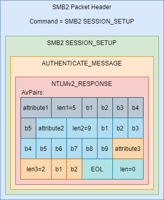

Authenticate message được xử lý bởi hàm SsprHandleAuthenticateMessage trong module msv1_0.dll. Trong các lần kiểm tra ban đầu, hàm này bảo đảm rằng, mảng AvPairs sẽ chứa các attribute sau: 0x0001 (MsvAvNbComputerName), 0x0002 (MsvAvNbDomainName). Tuy nhiên value của nó không được kiểm tra, nó chỉ kiểm tra bằng cách duyệt qua mảng và kiểm tra xem attribute được yêu cầu có tồn tại hay không và độ dài của nó có nằm trong cấu trúc hay không. Nếu độ dài quá lớn, việc truyền tải sẽ bị dừng lại. Vì vậy, trên thực tế, MsvAvEOL không được kiểm tra có hợp lệ hay không.

Tại thời điểm này, ta đã tìm ra rằng ta có thể tạo ra một yêu cầu có thể giúp ta trả lời cho câu hỏi sau: Cho hai byte tại offset x, thuộc kiểu uint16, giá trị có lớn hơn y không? x và y được kiểm soát bởi ta. Hãy xem xét gói tin sau:

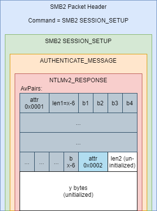

Nội dung của value 0x0001 (MsvAvNbComputerName) không quan trọng, vì vậy ta có thể sử dụng nó để điều chỉnh offset của value thứ hai. Đối với value thứ hai, ta chỉ set attribute là 0x0002 (MsvAvNbDomainName), mà không khởi tạo len và value. Đồng thời set kích thước của toàn bộ gói sao cho có y byte theo trường length. Có hai kết quả có thể xảy ra tùy thuộc vào giá trị chưa được khởi tạo của trường length của value thứ hai:

- length <= y: Trong trường hợp này, kiểm tra được pass vì giá trị 0x0002 hợp lệ (MsvAvNbDomainName) được tìm thấy. Máy chủ trả về 0xC000006D (STATUS_LOGON_FAILURE) vì thông tin xác thực không chính xác.
- length > y: Trong trường hợp này, việc kiểm tra không thành công, vì giá trị thứ hai có độ dài không hợp lệ và bị loại bỏ. Máy chủ trả về 0xC000000D (STATUS_INVALID_PARAMETER) cho trường hợp này.

Theo phản hồi từ server, ta luôn có thể suy ra câu trả lời cho câu hỏi ở trên.

Tuy nhiên, NTLM Authenticate message được giới hạn ở 0xB48 byte và sẽ bị loại bỏ nếu nó lớn hơn thế. Việc kiểm tra được thực hiện bởi hàm SspContextGetMessage [](SpLsaModeInitialize-->NtLmFunctionTable.SpAcceptLsaModeContext-->SsprHandleAuthenticateMessage-->SspContextGetMessage)trong msv1_0.dll module. Giả sử ta chỉ ghi vào 1 byte len, byte còn lại sẽ chứa giá trị chưa được khởi tạo, thì có bypass được việc này không. Rất tiếc là không, vì giá trị uint16 được mã hóa dưới dạng little endian.
Không thể đạt được điều mình muốn trong một phiên SMB duy nhất, ta sẽ đi xem xét thêm các yếu tố khác.

## Observation #1: Lookaside lists
Như đã đề cập trong nghiên cứu trước ([CVE-2020-0796](https://github.com/datntsec/CVE-2020-0796)), các modules xử lý SMB trong kernel (srv2.sys và srvnet.sys) sử dụng chức năng phân bổ tùy chỉnh - SrvNetAllocateBuffer - được export bởi srvnet.sys. Hàm này sử dụng lookaside lists cho các phân bổ nhỏ để tối ưu hóa. Lookaside lists được sử dụng để lưu trữ một cách hiệu quả một tập hợp các bộ đệm có kích thước cố định, có thể tái sử dụng cho trình điều khiển.

Lookaside lists được tạo khi khởi tạo, danh sách cho từng kích thước và bộ xử lý logic được mô tả trong bảng sau:

| → Allocation size ↓Logical Processor | 0x1100   |  0x2100  |  0x4100  |  0x8100  | 0x10100  |  0x20100 | 0x40100  | 0x80100  | 0x100100 |
|--------------------------------------|----------|----------|----------|----------|----------|----------|----------|----------|----------|
|              Processor 1             |     📝    |     📝    |     📝    |     📝    |     📝    |     📝    |     📝    |     📝    |     📝    |
|              Processor 2             |     📝    |     📝    |     📝    |     📝    |     📝    |     📝    |     📝    |     📝    |     📝    |
|                 ...                  |          |          |          |          |          |          |          |          |          |
|              Processor n             |     📝    |     📝    |     📝    |     📝    |     📝    |     📝    |     📝    |     📝    |     📝    |

Mỗi ô có ký hiệu "📝" là một lookaside list riêng biệt. Để đơn giản hóa phân tích, ta sẽ giả sử rằng mục tiêu của chúng ta chỉ có một Logical Processor. Trong trường hợp này, miễn là cùng một lượng byte được cấp phát, cùng một lookaside list được sử dụng thì cũng sẽ cùng một buffer được cấp phát được sử dụng lại nhiều lần. Ta có thể sử dụng điều này để có một số quyền kiểm soát đối với dữ liệu chưa được khởi tạo.

## Observation #2: Failing the decompression
Hãy xem lại điều gì sẽ xảy ra khi một compressed packet được decompress (tham khảo writeup [CVE-2020-0796](https://github.com/datntsec/CVE-2020-0796) để biết thêm chi tiết và mã giả):

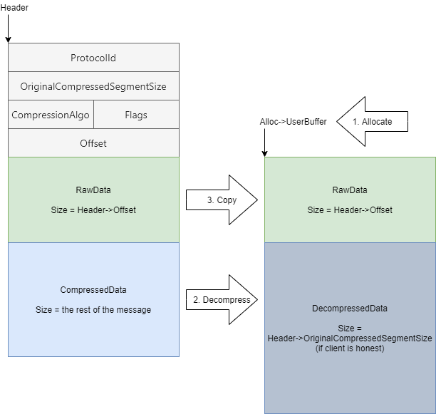

Trong trường hợp CompressedData không hợp lệ, giai đoạn decompression sẽ không thành công, giai đoạn copy không được thực thi và kết nối bị ngắt. Nhưng decompression có thể không thành công chỉ sau khi giải nén một phần của CompressedData hợp lệ. Điều này cho phép ta tạo ra một yêu cầu sao cho dữ liệu mà ta lựa chọn sẽ được ghi ở offset mà ta lựa chọn, như hình sau:

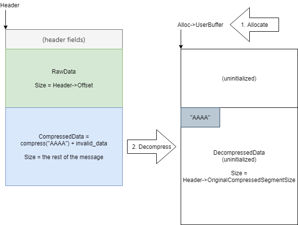

## Back to the NTLM Authenticate message
Ta có thể sử dụng các Observation trên để làm cho kỹ thuật của ta hoạt động bằng cách sử dụng hai bước:
1. Gửi một message với một compressed data không hợp lệ để chỉ một byte 0 duy nhất được giải nén. Byte đó sẽ là byte thứ nhất của trường length của Value thứ hai trong mảng AvPairs.
2. Gửi một message giống như trước đây, nhưng đảm bảo rằng cùng một lookaside list được sử dụng cho việc phân bổ, sao cho byte 0 sẽ ở đó.

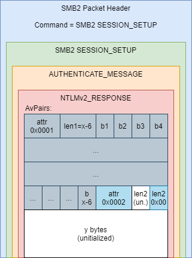

Lần này, kỹ thuật này có thể trả lời câu hỏi sau: Cho một byte ở offset x, giá trị có lớn hơn y không? Như trước đây, x và y được kiểm soát bởi ta.

Vì ta có thể sử dụng lại bộ đệm nhiều lần bằng cách đảm bảo sử dụng cùng một lookaside list, chúng ta có thể lặp lại các bước nhiều lần trong khi thay đổi y và cuối cùng suy ra giá trị byte tại một khoảng chênh lệch nhất định.

Tuy nhiên, kỹ thuật này có một hạn chế - offset của byte mà chúng ta có thể đọc được giới hạn ở byte 0xADB từ đầu của packet buffer. Đó là do offset của NTLM Authenticate message (AUTHENTICATE_MESSAGE) được giới hạn ở 0x40 byte sau khi kết thúc SMB2 SESSION_SETUP headers (được thực thi bởi hàm Smb2ValidateSessionSetup trong srv2.sys) và kích thước của NTLM Authenticate message (AUTHENTICATE_MESSAGE) bị giới hạn thành 0xB48 byte.

## Overcoming the offset limitation
Giả sử rằng ta muốn đọc một byte ở offset 0x1100. Ta không thể làm điều đó trực tiếp bằng kỹ thuật trên, tuy nhiên ta vẫn có thể sử dụng thêm kĩ thuật sau: vì các buffer được tái sử dụng từ lookaside lists, ta có thể "nâng" byte đích thông qua hàm decompression bằng cách đặt trường Offset để vượt qua byte đó. Ta chỉ cần đảm bảo rằng dữ liệu nằm ở đó có thể được hiểu là dữ liệu nén hợp lệ, nếu không việc Copy sẽ không xảy ra.


Buffer của gói tin chứa dữ liệu được gửi đến bởi client sẽ chứa thêm 16 byte headers không được copy khi quá trình giải nén diễn ra. Kết quả là, dữ liệu được copy và giải nén, bao gồm cả target byte, được sao chép đến một vị trí gần 16 byte hơn phần đầu của buffer được cấp phát. Chúng ta có thể lặp lại điều đó vài lần, cho đến khi offset của target byte đủ thấp.

## Address leak POC
Bạn có thể tìm thấy một script chứng minh kỹ thuật trên [tại đây](https://github.com/ZecOps/CVE-2020-0796-RCE-POC/blob/793b9360347b40341c5128bf9723edbd7c492b24/leak_pool_address.py). Hãy nhớ rằng ta đã giả định rằng máy tính server chỉ có một bộ xử lý logic, vì vậy bạn sẽ phải định cấu hình máy ảo của mình đúng cách để đoạn script hoạt động. Nếu mọi việc suôn sẻ, đoạn script sẽ đọc và leak được địa chỉ của NonPagedPoolNx pool. Trên thực tế, đó sẽ là địa chỉ của một trong những buffer nằm cùng một lookaside lists.

Vì kĩ thuật này có khá nhiều hạn chế, nên tôi không phân tích sâu hơn. Tuy nhiên bạn vẫn có thể đọc script trên và tự phân tích.

# A different approach – decompression
Trong quá trình nghiên cứu, Zecops nhận ra rằng gói SMB được giải nén không phải là cấu trúc phức tạp duy nhất có thể không hợp lệ theo nhiều cách khác nhau. Ngay cả trước khi xử lý tất cả các cấu trúc liên quan đến SMB, compressed buffer cũng có thể không hợp lệ. Nếu giải nén không thành công, kết nối đến server sẽ bị ngắt.

Microsoft cung cấp ba thuật toán nén để bạn lựa chọn khi triển khai SMB: LZNT1, Plain LZ77 và LZ77 + Huffman. Ta sẽ chỉ xem xét LZNT1 vì nó khá đơn giản - [khoảng 80 dòng Python cho một hàm giải nén](https://github.com/MITRECND/chopshop/blob/master/ext_libs/lznt1.py). Tôi sẽ nói sơ về quá trình giải nén: dữ liệu nén bao gồm một chuỗi các block được nén, mỗi block được bắt đầu bằng một biến uint16 đánh dấu độ dài của block đó. Khi gặp độ dài bằng 0, quá trình giải nén sẽ hoàn tất. Ta sẽ sử dụng điều này để ghi vào một chuỗi byte 0 tượng trưng cho dữ liệu nén hợp lệ. Mục đích để trả lời cho câu hỏi ở trên: Cho một byte ở offset x, giá trị có lớn hơn y không? Tất nhiên, x và ý vẫn sẽ do ta kiểm soát.

Dưới đây là một ví dụ về dữ liệu nén mà ta sẽ gửi:


Có hai kết quả có thể xảy ra tùy thuộc vào giá trị chưa khởi tạo của byte thứ nhất của trường length:
- length <= y: Trong trường hợp này, block đầu tiên sẽ toàn byte 0, điều này hoàn toàn hợp lệ và length của block tiếp theo sẽ bằng 0, việc giải nén sẽ hoàn tất. Server sẽ trả lại một response.
- length > y: Trong trường hợp này, block nén đầu tiên hoặc thứ hai sẽ chứa các byte 0xFF, block này sẽ không giải nén được. Server sẽ ngắt kết nối do dữ liệu nén không hợp lệ.

Cũng giống như kỹ thuật trước, chúng ta có thể sử dụng các Observation số 1 và số 2 để tạo ra một message với một byte chưa được khởi tạo ở giữa message bằng cách sử dụng hai bước:
1. Gửi một message với dữ liệu nén không hợp lệ để chỉ một phần dữ liệu được giải nén, tương tự như hình trên
2. Gửi message thứ hai và đảm bảo rằng cùng một lookaside list được sử dụng trong message thứ 1, để các byte từ bước 1 sẽ ở đó.

Lưu ý rằng giá trị Offset trong header gói SMB sẽ trỏ đến dữ liệu nén, dữ liệu này có thể hợp lệ hay không tùy thuộc vào giá trị của byte chưa được khởi tạo. 

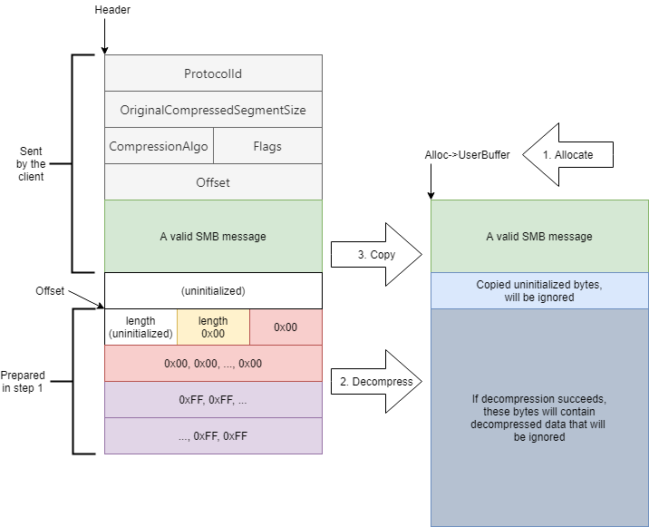

Ưu điểm đáng chú ý nhất của kỹ thuật này so với kỹ thuật trước là không có giới hạn offset nữa.

Như vậy, tổng kết lại, ta có 2 kỹ thuật để đọc một vùng nhớ chưa được khởi tạo từ pool buffer được cấp phát bởi hàm SrvNetAllocateBuffer của module srvnet.sys. Kỹ thuật đầu tiên tạo ra một gói SMB đặc biệt, sau đó suy luận thông tin thông qua response của server. Kỹ thuật thứ hai với ít hạn chế hơn, ta sẽ tạo ra một dữ liệu được nén đặc biệt và gửi nó đi, sau đó suy luận thông tin dựa trên việc server có ngắt kết nói hay không.

Như vậy, ta có thể sử dụng một trong 2 kĩ thuật trên để khai thác. Và như tôi đã nói, kĩ thuật đầu tiên có nhiều hạn chế, nên ta sẽ chỉ đi sâu vào kĩ thuật thứ 2.

Kĩ thuật này sẽ giúp ta khai thác theo hướng write-what-where primitive mà Zecops đã chứng minh trước đây trong [nghiên cứu trước](https://blog.zecops.com/vulnerabilities/exploiting-smbghost-cve-2020-0796-for-a-local-privilege-escalation-writeup-and-poc/) về khả năng đạt được local privilege escalation. Ta sẽ dùng kĩ thuật này để leak địa chỉ trong memory layout để có thể sử dụng write-what-where primitive. Không may mắn là memory được cấp phát bởi hàm SrvNetAllocateBuffer chủ yếu được sử dụng cho dữ liệu mạng như gói SMB và không chứa bất kỳ con trỏ system nào. Và vì ta cần đạt được RCE, nên việc leak các vùng nhớ chưa được khởi tạo bởi các lần cấp phát trước của hàm SrvNetAllocateBuffer là vô ích do không chắc chắn được vị trí con trỏ cần tìm. Ta cần tìm một thứ gì đó có thể hữu ích hơn.

## SrvNetAllocateBuffer and the allocated buffer layout
Như tôi có nói trong nghiên cứu về local privilege escalation ([CVE-2020-0796](https://github.com/datntsec/CVE-2020-0796)), hàm SrvNetAllocateBuffer không chỉ trả về một buffer với kích thước được yêu cầu. Thay vào đó nó sẽ trả về một con trỏ trỏ đến vùng nằm ngay bên dưới user buffer của cấu trúc pool-allocated memory block, chứa thông tin về buffer được cấp phát. Cách bố trí của pool-allocated memory block như sau:

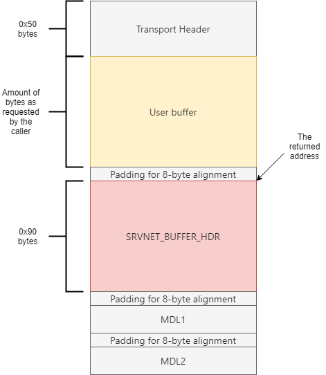

Mặc dù kỹ thuật đọc của ta chỉ có thể đọc các byte từ vùng "User Buffer", ta vẫn có thể dùng một kĩ thuật khác để copy các phần của cấu trúc SRVNET_BUFFER_HDR vào "User Buffer" của một buffer khác để có thể đọc nó. Bằng cách đặt trường Offset trỏ đến cấu trúc SRVNET_BUFFER_HDR nằm ngoài dữ lệu mà ta muốn đọc. Ta chỉ cần đảm bảo rằng dữ liệu nằm ở đó có thể được hiểu là dữ liệu nén hợp lệ, ngược lại, việc copy sẽ không được diễn ra.


## Hunting for pointers
Hãy xem xét các trường của cấu trúc SRVNET_BUFFER_HDR và ​​xem liệu có nội dung nào đáng để ta đọc không:

``` c
#pragma pack(push, 1)
struct SRVNET_BUFFER_HDR {
/*00*/  LIST_ENTRY ConnectionBufferList;
/*10*/  WORD BufferFlags; // 0x01 - no transport header, 0x02 - part of a lookaside list
/*12*/  WORD LookasideListIndex; // 0 to 8
/*14*/  WORD LookasideListLogicalProcessor;
/*16*/  WORD TracingDataCount; // 0, 1 or 2, for TracingPtr1/2, TracingUnknown1/2
/*18*/  PBYTE UserBufferPtr;
/*20*/  DWORD UserBufferSizeAllocated;
/*24*/  DWORD UserBufferSizeUsed;
/*28*/  DWORD PoolAllocationSize;
/*2C*/  BYTE unknown1[4];
/*30*/  PBYTE PoolAllocationPtr;
/*38*/  PMDL pMdl1;
/*40*/  DWORD BytesProcessed;
/*44*/  BYTE unknown2[4];
/*48*/  SIZE_T BytesReceived;
/*50*/  PMDL pMdl2;
/*58*/  PVOID pSrvNetWskStruct;
/*60*/  DWORD SmbFlags;
/*64*/  PVOID TracingPtr1;
/*6C*/  SIZE_T TracingUnknown1;
/*74*/  PVOID TracingPtr2;
/*7C*/  SIZE_T TracingUnknown2;
/*84*/  BYTE unknown3[12];
};
#pragma pack(pop)
```

Các con trỏ `UserBufferPtr`, `PoolAllocationPtr`, `pMdl1`, `pMdl2` là những con trỏ trỏ vào bên trong pool-allocated memory block, với các offset có thể được tính toán trước, vì vậy ta chỉ cần đọc một trong số chúng là được. Việc có một con trỏ trỏ đến pool-allocated memory block sẽ chắc chắn giúp ích cho ta trong việc khai thác. Ngoài ra các con trỏ sau cũng rất quan trọng:
- **ConnectionBufferList**: Một danh sách liên kết của tất các buffer được nhận nhưng chưa được xử lý của một kết nối. Phần đầu của danh sách này là một connection object được tạo bởi hàm SrvNetAllocateConnection trong srvnet.sys. Một buffer được thêm vào danh sách bởi hàm SrvNetWskReceiveComplete. Trong trường hợp của ta, sẽ chỉ có duy nhất một buffer trong danh sách, vì vậy cả 2 con trỏ (Flink và Blink của cấu trúc LIST_ENTRY) sẽ cùng trỏ đến đầu danh sách bên trong connection object.
- **pSrvNetWskStruct**: Ban đầu, một con trỏ trỏ đến connection object được đề cập ở trên. Con trỏ được set bởi hàm SrvNetWskReceiveEvent, nhưng bị ghi đè bởi hàm SrvNetWskReceiveComplete bằng con trỏ trỏ đến cấu trúc SRVNET_BUFFER_HDR. Vì vậy, đọc nó không hữu ích hơn đọc một trong bốn con trỏ đã nói ở trên. Nhân tiện, nếu bạn tìm kiếm “pSrvNetWskStruct”, bạn sẽ thấy rằng nó có một vai trò trong việc khai thác EternalBlue.
- **TracingPtr1/2**: Các con trỏ này chỉ được sử dụng khi tính năng tracing được kích hoạt.


Như bạn có thể thấy, con trỏ hữu ích duy nhất khác để chúng ta đọc là một con trỏ trong cấu trúc ConnectionBufferList. Cả hai con trỏ (Blink và Flink trong cấu trúc LIST_ENTRY) đều trỏ đến connection object. Object này được đặt tên là SRVNET_RECV bởi nhà nghiên cứu EternalBlue, vì vậy ta cũng sẽ sử dụng tên này.

## Getting a module base address
Bây giờ, chúng ta đã biết cách lấy hai con trỏ - một con trỏ trỏ tới pool-allocated memory block và một con trỏ trỏ tới cấu trúc SRVNET_RECV - chúng ta có thể tự do sửa đổi hai buffers bằng cách sử dụng write-what-where primitive. Có thể sẽ có nhiều cách để đạt được RCE, nhưng việc lấy một base address của một module sẽ là lựa chọn đơn giản nhất vì có rất nhiều thứ từ chúng mà ta có thể sửa đổi trong data section của một module. Như chúng ta đã thấy, không có một con trỏ nào trong memory block được cấp phát bởi SrvNetAllocateBuffer trỏ đến một module. Tuy nhiên, vẫn có một số con trỏ trỏ đến các module:

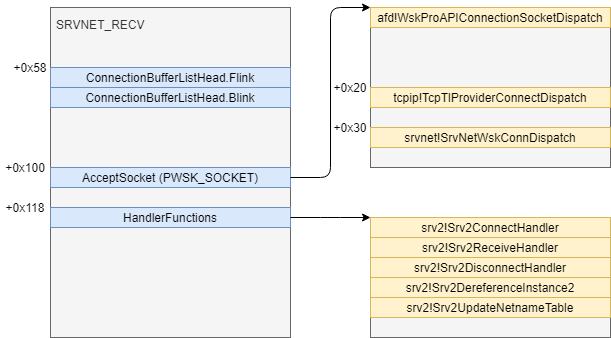

Kĩ thuật đọc mà ta có chỉ cho phép ta đọc được dữ liệu ở vùng "User Buffer", trong khi đó các con trỏ này lại ở khá xa và được trỏ bởi khá nhiều con trỏ khác. Ta cần một đoạn code có thể làm được điều sau để copy giá trị con trỏ vào vùng "User Buffer":

``` c
ptr1 = *(pSrvNetRecv + offset1)
value = *ptr1
ptr2 = *(pSrvNetRecv + offset2)
*ptr2 = value
```

Nếu ta có thể tìm thấy một đoạn mã như vậy, ta sẽ kích hoạt nó để sao chép con trỏ đầu tiên (ví dụ: HandlerFunctions) vào vùng "User Buffer", đọc nó, sau đó sao chép con trỏ thứ hai (ví dụ: con trỏ hàm Srv2ConnectHandler) vào "User Buffer" và đọc nó, suy ra module base address từ nó. Nhóm [Zecops](https://www.zecops.com/) đã tìm kiếm một đoạn mã như vậy trong một thời gian dài, nhưng không tìm thấy một đoạn mã phù hợp nào. Cuối cùng, họ sử dụng lựa chọn khác liên quan đến hàm SrvNetFreeBuffer (đã được đơn giản hóa như bên dưới) có chức năng gần như mong muốn:

``` c
void SrvNetFreeBuffer(PSRVNET_BUFFER_HDR Buffer)
{
    PMDL pMdl1 = Buffer->pMdl1;
    PMDL pMdl2 = Buffer->pMdl2;
 
    if (pMdl2->MdlFlags & 0x0020) {
        // MDL_PARTIAL_HAS_BEEN_MAPPED flag is set.
        MmUnmapLockedPages(pMdl2->MappedSystemVa, pMdl2);
    }
 
    if (Buffer->BufferFlags & 0x02) {
        if (Buffer->BufferFlags & 0x01) {
            pMdl1->MappedSystemVa = (BYTE*)pMdl1->MappedSystemVa + 0x50;
            pMdl1->ByteCount -= 0x50;
            pMdl1->ByteOffset += 0x50;
            pMdl1->MdlFlags |= 0x1000; // MDL_NETWORK_HEADER
 
            pMdl2->StartVa = (PVOID)((ULONG_PTR)pMdl1->MappedSystemVa & ~0xFFF);
            pMdl2->ByteCount = pMdl1->ByteCount;
            pMdl2->ByteOffset = pMdl1->MappedSystemVa & 0xFFF;
            pMdl2->Size = /* some calculation */;
            pMdl2->MdlFlags = 0x0004; // MDL_SOURCE_IS_NONPAGED_POOL
        }
 
        Buffer->BufferFlags = 0;
 
        // ...
 
        pMdl1->Next = NULL;
        pMdl2->Next = NULL;
 
        // Return the buffer to the lookaside list.
    } else {
        SrvNetUpdateMemStatistics(NonPagedPoolNx, Buffer->PoolAllocationSize, FALSE);
        ExFreePoolWithTag(Buffer->PoolAllocationPtr, '00SL');
    }
}
```

Khi giải phóng bộ đệm, nếu buffer flags là 0x02 (có nghĩa là buffer là một phần của một lookaside list) và 0x01 (có nghĩa là buffer không có transport header) được set, một số thao tác được thực hiện trên hai MDL objects để thêm transport header trước khi set lại các flag về 0 và trả buffer trở lại lookaside list. Nếu chúng ta xem xét kĩ đằng sau các thao tác trên các MDL object, chúng ta có thể nhận thấy rằng đoạn code thực hiện phép double-dereference-read theo sau là  double-dereference-write với hai biến mà ta kiểm soát (hai con trỏ MDL), đó là những gì ta đang tìm kiếm. Nhược điểm là nội dung mà chúng ta muốn đọc cũng bị sửa đổi, một tác dụng phụ mà ta hy vọng có thể tránh được.

Với những điều trên, đây là cách ta quản lý để đọc con trỏ AcceptSocket:
1. Chuẩn bị buffer A từ một lookaside list sao cho vùng “User buffer” được lấp đầy bởi các số không. Vùng user buffer của buffer này sẽ chứa con trỏ mà chúng ta sẽ đọc. 
2. Chuẩn bị buffer B từ một lookaside list khác để:
- Con trỏ pMdl1 trỏ đến địa chỉ của con trỏ AcceptSocket trừ đi 0x18, (do offset của MappedSystemVa là 0x18 trong cấu trúc MDL).
- Con trỏ pMdl2 trỏ đến vùng “User buffer” của Buffer A.
- Trường Flags được set thành 0x03.

Ta có thể ghi đè các trường cấu trúc SRVNET_BUFFER_HDR bằng cách giải nén chúng từ buffer lớn hơn bằng cách sử dụng kỹ thuật được mô tả trong phần Observation #2 của phần trên.

3. Khi Buffer B được giải phóng, các hoạt động sau sẽ diễn ra:

- Các MDL flags sẽ được đọc từ MDL thứ hai tại buffer A. Nếu MDL_PARTIAL_HAS_BEEN_MAPPED flag được set, MmUnmapLockedPages sẽ được gọi và hệ thống có khả năng bị crash. Đó là lý do tại sao chúng tôi lấp đầy buffer bằng các số không ở bước 1.
- Con trỏ AcceptSocket và bộ nhớ xung quanh nó sẽ được sửa đổi như được mô tả ở đây:

```
+00 |  00 00 00 00 00 00 00 00
+08 |  __ __ __|10 __ __ __ __
+10 |  __ __ __ __ __ __ __ __
+18 |  [+50..................]  <--  AcceptSocket
+20 |  __ __ __ __ __ __ __ __
+28 |  [-50......] [+50......]
```

- Con trỏ AcceptSocket và bộ nhớ xung quanh nó sẽ được đọc như mô tả ở đây:
```
+00 |  __ __ __ __ __ __ __ __
+08 |  __ __ __ __ __ __ __ __
+10 |  __ __ __ __ __ __ __ __
+18 |  ab cd ef gh ij kl mn op  <--  AcceptSocket
+20 |  __ __ __ __ __ __ __ __
+28 |  qr st uv wx __ __ __ __
```

- Vùng “User buffer” của buffer A sẽ được sửa đổi như được mô tả ở đây: (Các byte màu cam chứa con trỏ mà chúng ta muốn đọc. Chúng ta chỉ cần sắp xếp chúng đúng cách.)
```
+00 |  00 00 00 00 00 00 00 00
+08 |  ?? ?? 04 00 __ __ __ __
+10 |  __ __ __ __ __ __ __ __
+18 |  __ __ __ __ __ __ __ __
+20 |  00 c0 ef gh ij kl mn op
+28 |  qr st uv wx ab 0d 00 00
```
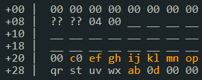

4. Đọc con trỏ AcceptSocket từ vùng “User buffer” của buffer A.

Tin tốt là ta đã đọc được con trỏ. Tin xấu là ta đã làm hỏng một số dữ liệu trong cấu trúc SRVNET_RECV. May mắn cho ta, lỗi không ảnh hưởng đến hệ thống miễn là không có gì xảy ra với kết nối có liên quan. Khi điều gì đó xảy ra, ví dụ: đóng kết nối, hệ thống sẽ bị crash. Đó không phải là vấn đề vì ta sẽ sớm có RCE và ta có thể sửa lỗi nếu ta muốn.

Sau khi đọc con trỏ AcceptSocket, ta tiếp tục sử dụng kỹ thuật tương tự để đọc con trỏ srvnet!SrvNetWskConnDispatch. Lý do ta đọc con trỏ AcceptSocket mà không phải con trỏ HandlerFunctions là vì mảng của HandlerFunctions được chia sẻ giữa tất cả các kết nối, trong khi buffer được trỏ bởi AcceptSocket không được chia sẻ với các kết nối khác. Do đó, nếu ta làm hỏng các phần trong AcceptSocket, nó sẽ chỉ ảnh hưởng đến sự ổn định của một kết nối.

Nếu ta có bản sao của tệp srvnet.sys được sử dụng trên máy tính target, ta có thể dễ dàng suy ra base address của module srvnet.sys bằng cách trừ đi offset của con trỏ SrvNetWskConnDispatch mà chúng ta đã leak được. 

## Implementing arbitrary read
Ngay từ khi bắt đầu nghiên cứu này, ta đã có một phương thức convenient write-what-where primitive, nhưng không có gì cho phép ta đọc bộ nhớ. Ta đã làm việc chăm chỉ cho đến bây giờ để đạt được một số khả năng đọc bộ nhớ, và tại thời điểm này, ta cảm thấy rằng ta có đủ công cụ để làm cho cuộc sống của ta dễ dàng hơn và thực hiện một phương pháp read primitive tùy ý thuận tiện. Ta bắt đầu bằng cách khám phá các khả năng gọi một hàm tùy ý.

Giả sử rằng ta có base address của module srvnet.sys, ta có thể gọi bất kỳ hàm nào của module. Nhưng còn các đối số của hàm thì sao? Hàm srv2!Srv2ReceiveHandler được gọi bởi SrvNetCommonReceiveHandler và lệnh gọi có dạng như sau:

``` c
HandlerFunctions = *(pSrvNetRecv + 0x118);
Arg1 = *(ULONG_PTR)(pSrvNetRecv + 0x128);
Arg2 = *(ULONG_PTR)(pSrvNetRecv + 0x130);
(HandlerFunctions[1])(Arg1, Arg2, Arg3, Arg4, Arg5, Arg6, Arg7, Arg8);
```

Hai đối số đầu tiên được đọc từ cấu trúc SRVNET_RECV, vì vậy ta có thể kiểm soát chúng. Ta không có nhiều quyền kiểm soát đối với các đối số khác. Quy ước gọi x86-64 chỉ định rằng người gọi có trách nhiệm phân bổ và giải phóng không gian ngăn xếp cho các đối số, vì vậy mặc dù hàm 8 đối số được dự định gọi, chúng ta có thể thay thế con trỏ bằng một hàm mong đợi bất kỳ khác.


Dưới đây là các bước chúng tôi đã sử dụng để kích hoạt lệnh gọi hàm:
1. Gửi một message được tạo đặc biệt để con trỏ cấu trúc SRVNET_RECV của kết nối sẽ được copy vào buffer mà ta có thể đọc.
2. Gửi một message hợp lệ khác, message này sẽ sử dụng lại cùng một cấu trúc SRVNET_RECV, nhưng chưa đóng kết nối. Lưu ý rằng khi kết nối bị đóng, cấu trúc SRVNET_RECV không được giải phóng. Hàm SrvNetPrepareConnectionForReuse được gọi để set lại cấu trúc để nó có thể được sử dụng lại cho kết nối tiếp theo.
3. Đọc con trỏ cấu trúc SRVNET_RECV mà ta đã copy ở bước 1.
4. Thay thế con trỏ HandlerFunctions và các đối số bằng cách sử dụng kĩ thuật write-what-where primitive.
5. Gửi một message bổ sung qua kết nối từ bước 2 để hàm thay thế cho srv2!Srv2ReceiveHandler được gọi.

Bây giờ tất cả những gì ta phải làm là tìm một hàm để copy bộ nhớ từ vị trí này sang vị trí khác, để ta có thể copy bộ nhớ tùy ý vào pool buffer mà ta có thể đọc từ đó. memcpy xuất hiện trong tâm trí và srvnet.sys có một hàm như vậy (chính xác là memmove), nhưng hàm này yêu cầu đối số thứ ba, đối số dùng để xác định số byte cần được sao chép mà ta không kiểm soát được. Tuy nhiên, ta không bị giới hạn bởi các hàm được triển khai trong srvnet.sys, ta cũng có thể gọi các hàm từ import table của srvnet và hàm RtlCopyUnicodeString là một sự lựa chọn hoàn hảo để thực hiện điều ta muốn.

Hàm RtlCopyUnicodeString nhận hai con trỏ UNICODE_STRING làm đối số và sao chép nội dung của source string sang destination string. Không giống như các C string được kết thúc bằng NULL, các string trong kernel được xác định bởi cấu trúc UNICODE_STRING chứa một con trỏ trỏ đến string và length của string tính bằng byte. String buffer có thể chứa bất kỳ dữ liệu nhị phân nào. Nếu bạn nhìn vào code của hàm RtlCopyUnicodeString, bạn có thể thấy rằng việc copy được thực hiện với hàm memmove, tức là copy dữ liệu nhị phân thuần túy. Tất cả những gì chúng ta phải làm là chuẩn bị hai cấu trúc UNICODE_STRING và gọi RtlCopyUnicodeString, sau đó đọc dữ liệu đã được copy:

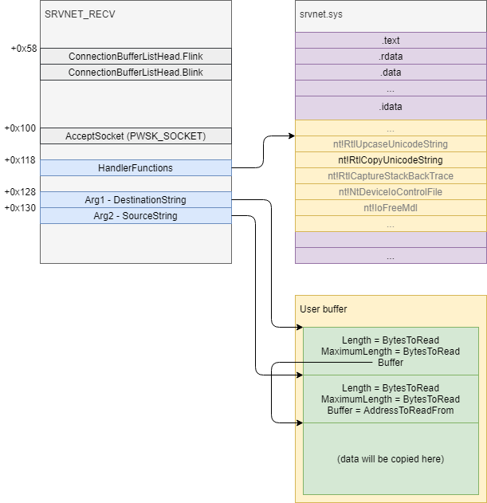

## Executing shellcode
Sau khi đạt được convenient arbitrary read primitive, ta chuyển sang thử thách tiếp theo hướng tới mục tiêu Remote Code Execute thông qua việc chạy một shellcode. Ta sẽ sử dụng kỹ thuật mà Morten Schenk đã trình bày trong bài nói chuyện về [Black Hat USA 2017](https://www.blackhat.com/docs/us-17/wednesday/us-17-Schenk-Taking-Windows-10-Kernel-Exploitation-To-The-Next-Level%E2%80%93Leveraging-Write-What-Where-Vulnerabilities-In-Creators-Update.pdf) (trang 47-51).

Ý tưởng là viết một mã shellcode bên dưới cấu trúc KUSER_SHARED_DATA có địa chỉ không đổi, địa chỉ duy nhất không được ngẫu nhiên hóa trong kernel memory layout của các phiên bản Windows gần đây. Sau đó, sửa đổi page table entry liên quan, làm cho page có thể execute. Base address của các page table entry trong kernel là ngẫu nhiên, nhưng có thể được truy xuất từ ​​hàm MiGetPteAddress trong ntoskrnl.exe. Dưới đây là các bước ta sẽ sử dụng để thực thi shellcode của mình:
1. Sử dụng arbitrary read primitive để lấy base address của ntoskrnl.exe từ import table của srvnet.
2. Đọc base address của các page table entry từ hàm MiGetPteAddress, như được mô tả trong các trang trình bày của Morten.
3. Ghi shellcode vào địa chỉ KUSER_SHARED_DATA + 0x800 (0xFFFFF78000000800). Lưu ý rằng ta cũng có thể sử dụng một trong các pool buffer để lưu trữ shellcode, việc sử dụng KUSER_SHARED_DATA là để làm mọi thứ đơn giản hơn.
4. Tính toán địa chỉ page table entry liên quan và xóa bit NX để cho phép execute, như được mô tả trong các trang trình bày của Morten.
5. Gọi shellcode bằng cách sử dụng kĩ thuật đã trình bày ở trên để gọi một hàm tùy ý.

Shellcode mà Zecops sử dụng để reverse shell là [sleepya’s shellcode](https://github.com/worawit/MS17-010/tree/master/shellcode) được viết phục vụ cho mục đích khai thác EternalBlue. Họ đã sửa đổi shellcode trên trên có thể thực hiện được trên các phiên bản windows gần đây

# Debug


Thông tin của một gói SMB sẽ có cấu trúc gần giống như trên. Giả sử chúng ta cần leak địa chỉ của User Buffer, ta sẽ cần đọc con trỏ UserBufferPtr. Để đọc được con trỏ này, ta sẽ tận dụng kĩ thuật đặt trường offset nằm vượt ra khỏi con trỏ để nó được copy vào vùng user buffer của một buffer khác.
Ví dụ về gói SMB do client gửi đi có nội dung như sau:
```c
Header:
-   Id = 0x424d53fc
-   OriginalCompressedSegmentSize = 0x0
-   CompressionAlgorithm = 1
-   Flag = 0
-   Offset = 0x2116
Data = ‘A’ * 0x1101.
```


